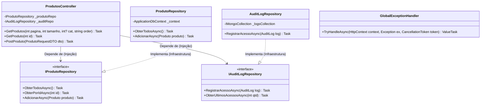
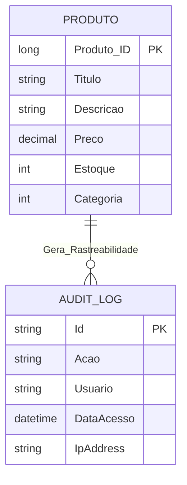

# 🏴‍☠️ Rei dos Piratas - API RESTful & Clean Architecture (Sprint 4)

## 📖 1. Visão Geral
Este repositório contém a consolidação definitiva do ecossistema de backend do e-commerce "Rei dos Piratas". A aplicação monolítica em padrão MVC das sprints anteriores foi totalmente refatorada para uma **API RESTful de alta performance**, estruturada sob os princípios de **Clean Architecture** e orientada por boas práticas de design de código (**DDD**, **SOLID** e **Clean Code**).

O foco principal desta Sprint 4 foi o desacoplamento completo da camada de visualização, implementação de uma estratégia de persistência híbrida (Relacional e NoSQL), maturidade de endpoints com suporte a paginação, filtros, ordenação avançada, hipermídia (**HATEOAS**), segurança rigorosa via tokens **JWT**, observabilidade completa e uma suíte robusta de testes automatizados (Unitários e de Integração).

---

## 🏗️ 2. Arquitetura da Solução e Modelagem de Dados

O projeto segue estritamente a divisão de responsabilidades da **Clean Architecture**, onde o fluxo de dependências aponta sempre para o centro (Domínio), garantindo que as regras de negócio permaneçam isoladas e agnósticas de frameworks, drivers de banco de dados ou protocolos de comunicação.

### Diagrama de Classes (Camada Core e Inversão de Dependência)
O diagrama abaixo ilustra o desacoplamento entre os controladores da API e a implementação concreta dos repositórios de dados na camada de infraestrutura através do princípio de **Inversão de Dependência (SOLID)**.



### Diagrama de Relacionamento (ER) - Persistência Híbrida

A solução adota um modelo de **banco de dados poliglota (Híbrido)**:

1.  **Oracle Database (Relacional):** Responsável pelos dados transacionais, estruturados e consistentes do catálogo de produtos, aplicando chaves primárias e integridade referencial.
    
2.  **MongoDB (NoSQL):** Responsável pelo armazenamento de logs de auditoria e telemetria, otimizado para gravação em alta volumetria e formato de documentos dinâmicos.
    




## ⚙️ 3. Etapas de Desenvolvimento e Estrutura do Projeto

O código-fonte está estruturado em quatro subprojetos lógicos:

1.  **`ReiDosPiratas.Domain` (Coração do Sistema):** Contém as entidades de domínio pura (`Produto`, `AuditLog`), enums e os contratos de interfaces (`IProdutoRepository`, `IAuditLogRepository`). Não referencia nenhuma biblioteca de persistência ou framework externo.
    
2.  **`ReiDosPiratas.Application` (Casos de Uso):** Contém os objetos de transferência de dados (DTOs) de entrada e saída, validadores de requisições e esquemas de suporte para paginação.
    
3.  **`ReiDosPiratas.Infrastructure` (Detalhes Técnicos de Infraestrutura):** Centraliza o acesso a dados. Contém o `ApplicationDbContext` estruturado para **EF Core 8 (Oracle Cloud)**, os scripts de migração (_Migrations_) e a implementação dos repositórios concretos, incluindo o driver nativo do **MongoDB**.
    
4.  **`ReiDosPiratas.API` (Camada de Apresentação REST):** Expõe os controladores HTTP, gerencia os middlewares, configura o Swagger, intercepta exceções globais e centraliza o contêiner de Injeção de Dependências nativo do .NET Core.
    

## 📡 4. Detalhamento das Rotas, Filtros e HATEOAS

A API implementa o **Nível 3 do Modelo de Maturidade de Richardson**, retornando metadados dinâmicos e links hipermídia para guiar o cliente sobre as ações subsequentes permitidas a partir daquele recurso.

### Parâmetros de Consulta do Endpoint GET `/api/produtos`

-   **`pagina`**: Inteiro indicando o índice da página atual (Padrão: 1).
    
-   **`tamanhoPagina`**: Quantidade de registros por lote (Padrão: 10).
    
-   **`categoria`**: Filtro numérico opcional por identificador de categoria.
    
-   **`ordenarPor`**: Critério de ordenação da listagem. Valores aceitos: `preco_asc`, `preco_desc`, `titulo`.
    

### Exemplo de Resposta JSON Estruturada com HATEOAS e Paginação:

JSON

```
{
  "paginaAtual": 1,
  "totalPaginas": 3,
  "tamanhoPagina": 2,
  "totalItens": 5,
  "dados": [
    {
      "id": 42,
      "titulo": "One Piece - Edição 100",
      "descricao": "O marco histórico da jornada de Luffy.",
      "preco": 34.90,
      "categoria": 1,
      "links": [
        { "rel": "self", "href": "https://localhost:5001/api/produtos/42", "method": "GET" },
        { "rel": "update_produto", "href": "https://localhost:5001/api/produtos/42", "method": "PUT" },
        { "rel": "delete_produto", "href": "https://localhost:5001/api/produtos/42", "method": "DELETE" }
      ]
    }
  ]
}

```

## 🔒 5. Segurança, Autenticação e Tratamento de Erros

### Autenticação JWT (Bearer Token)

As operações de escrita no catálogo (`POST`, `PUT`, `DELETE`) são protegidas contra acessos não autorizados. A autenticação utiliza criptografia simétrica com assinatura SHA-256 (mínimo de 128-bits exigido pelo ecossistema de segurança do .NET).

-   **Endpoint de Autenticação:** `POST /api/Auth/login`
    
-   **Credenciais de Teste Homologadas:** Usuário: `admin` | Senha: `admin123`
    

### Tratamento Global de Exceções Criptografado (.NET 8)

Para evitar o vazamento de dados de infraestrutura e _stack traces_ sensíveis na tela do cliente (vulnerabilidade crítica apontada pela OWASP e regulamentações como LGPD), a aplicação usa a interface nativa `IExceptionHandler`. Qualquer exceção não mapeada gera um log estruturado interno e retorna um padrão regulamentado **RFC 7807 (Problem Details)**:

JSON

```
{
  "status": 500,
  "title": "Erro interno no servidor",
  "detail": "Ocorreu um erro inesperado. Nossa equipe já foi notificada."
}

```

## 🩺 6. Monitoramento, Observabilidade e Diagnóstico

O ecossistema foi preparado para cenários de alta resiliência e auditoria de produção:

-   **Health Checks (`/health`):** Endpoint nativo configurado para responder em tempo real o status de saúde da aplicação de forma detalhada, verificando a conectividade com o banco transacional Oracle e barramentos periféricos.
    
-   **Logging Estruturado com Serilog:** Todos os eventos da aplicação geram payloads JSON estruturados enviados concorrentemente para o console e arquivos físicos rotacionados diariamente.
    
-   **Rastreabilidade por ID de Correlação:** Cada requisição HTTP recebe um `CorrelationId` exclusivo injetado no cabeçalho do log. Isso possibilita rastrear a jornada exata de um erro pontual entre múltiplos controladores.
    
-   **Distributed Tracing com OpenTelemetry:** Coleta e exportação de métricas nativas de latência de rede, taxas de falhas HTTP e tempo de execução de chamadas externas de banco de dados.
    

## 🚀 7. Guia de Instalação e Execução

### 1. Pré-requisitos
* .NET 8 SDK instalado localmente.
* Acesso ativo a uma instância de Banco de Dados Oracle Cloud.
* **MongoDB:** É obrigatório ter uma instância rodando na porta padrão `27017` para a gravação dos logs de auditoria. Caso utilize o Docker, basta rodar o comando abaixo em qualquer terminal para subir o banco em segundo plano:
  ```bash
  docker run -d -p 27017:27017 --name mongodb mongo:latest
    

### 2. Configurar Variáveis no `appsettings.json`

Verifique se as credenciais do seu banco Oracle e instâncias de logs estão configuradas no projeto `ReiDosPiratas.API`:

JSON

```
{
  "ConnectionStrings": {
    "OracleConnection": "User Id=ADMIN;Password=SUA_SENHA;Data Source=(description=...)"
  },
  "MongoDb": {
    "ConnectionString": "mongodb://localhost:27017",
    "DatabaseName": "ReiDosPiratasNoSQL"
  },
  "Jwt": {
    "Key": "UmaChaveSuperSecretaMuitoLongaParaOReiDosPiratasSprint4!"
  }
}

```

### 3. Executar Migrações e Inicializar Banco

Se o esquema do banco de dados ainda não estiver instanciado na nuvem, navegue até o diretório de infraestrutura e dispare a sincronização das tabelas:

Bash

```
cd ReiDosPiratas.Infrastructure
dotnet ef database update --startup-project ../ReiDosPiratas.API

```

### 4. Rodar a Aplicação

Inicie o servidor Kestrel:

Bash

```
cd ReiDosPiratas.API
dotnet run

```

Abra o navegador e acesse a interface interativa do Swagger para testar as rotas: `http://localhost:5000/swagger`


## 🛠️ 8. Guia Rápido de Teste no Swagger (Para Avaliação)

Para testar as rotas de criação de produtos (`POST /api/Produtos`), siga o fluxo de autorização abaixo:

1.  **Gerar Token:** Acesse o endpoint `POST /api/Auth/login`, clique em _Try it out_ e envie o JSON com as credenciais padrão (`admin` / `admin123`). Copie o texto do token retornado.
    
2.  **Autorizar no Swagger:** Suba até o topo da página e clique no botão verde **Authorize** (ícone de cadeado).
    
3.  **⚠️ IMPORTANTE:** Na caixa de texto, você deve digitar a palavra **`Bearer`**, dar **um espaço**, e depois colar o seu token (ex: `Bearer eyJhbGci...`).
    
4.  **Criar Produto:** Vá até o `POST /api/Produtos`, clique em _Try it out_ e utilize o **JSON de exemplo mastigado** abaixo para evitar erros de restrição de chave estrangeira (_Foreign Key_):
    

JSON

```
{
  "titulo": "Naruto - Volume 2",
  "descricao": "O início da jornada de Naruto Uzumaki para se tornar o Hokage da Aldeia da Folha.",
  "imagem_url": "https://mangas.com/naruto_vol1.jpg",
  "preco": 29.90,
  "preco_original": 35.00,
  "peso": 0.2,
  "estoque": 150,
  "condicao_produto": 1,
  "altura": 20.0,
  "largura": 13.7,
  "profundidade": 1.5,
  "funcionarioId": 1,
  "autor": "Masashi Kishimoto",
  "categoria": 1
}
```

## 🧪 9. Engenharia de Testes Automatizados (Padrão AAA)

A integridade arquitetural do sistema é assegurada por testes que utilizam o ecossistema de ferramentas **xUnit** e isolamento via dublês de testes do **Moq**, estruturados sob o padrão formal **Arrange, Act, Assert (AAA)**.

### Executar a Suíte de Testes

Para rodar todos os testes unitários e de integração de uma só vez a partir da raiz da solução, use o comando CLI:

Bash

```
dotnet test

```

### Exemplo Prático de Teste Unitário Isolado (Domínio e Aplicação)

Este teste garante o isolamento da regra de negócio da API. Usamos o `Mock` para blindar o repositório de dados e forçar o comportamento esperado sem gerar conexões físicas externas.

C#

```
[Fact]
public async Task GetProduto_DeveRetornarNotFound_QuandoProdutoNaoExistir()
{
    // Arrange (Preparação de Contexto Mockado)
    _mockProdutoRepo.Setup(repo => repo.ObterPorIdAsync(It.IsAny<int>()))
                    .ReturnsAsync((Produto)null);

    // Act (A execução do comportamento sob teste)
    var result = await _controller.GetProduto(999);

    // Assert (Validação das asserções de segurança)
    var actionResult = Assert.IsType<ActionResult<ProdutoResponseDTO>>(result);
    Assert.IsType<NotFoundObjectResult>(actionResult.Result);
}

```

### Exemplo Prático de Teste de Integração (WebApplicationFactory)

Este teste valida o fluxo de ponta a ponta levantando a API inteira na memória de forma controlada. Ele simula uma chamada HTTP real na rota pública, inspecionando cabeçalhos e códigos de status de rede.

C#

```
public class ProdutosIntegrationTests : IClassFixture<WebApplicationFactory<Program>>
{
    private readonly WebApplicationFactory<Program> _factory;

    public ProdutosIntegrationTests(WebApplicationFactory<Program> factory)
    {
        _factory = factory;
    }

    [Fact]
    public async Task GetProdutos_DeveRetornarSucesso_QuandoRotaChamada()
    {
        // Arrange
        var client = _factory.CreateClient();

        // Act
        var response = await client.GetAsync("/api/produtos");

        // Assert
        response.EnsureSuccessStatusCode(); 
        Assert.Equal(HttpStatusCode.OK, response.StatusCode);
    }
}

```

## 👨‍💻 10. Integrantes do Grupo CATECH

-   **Daniel Santana Corrêa Batista** [RM559622]
    
-   **Wendell Nascimento Dourado** [RA559336]
    
-   **Jonas de Jesus Campos de Oliveira** [RM561144]
